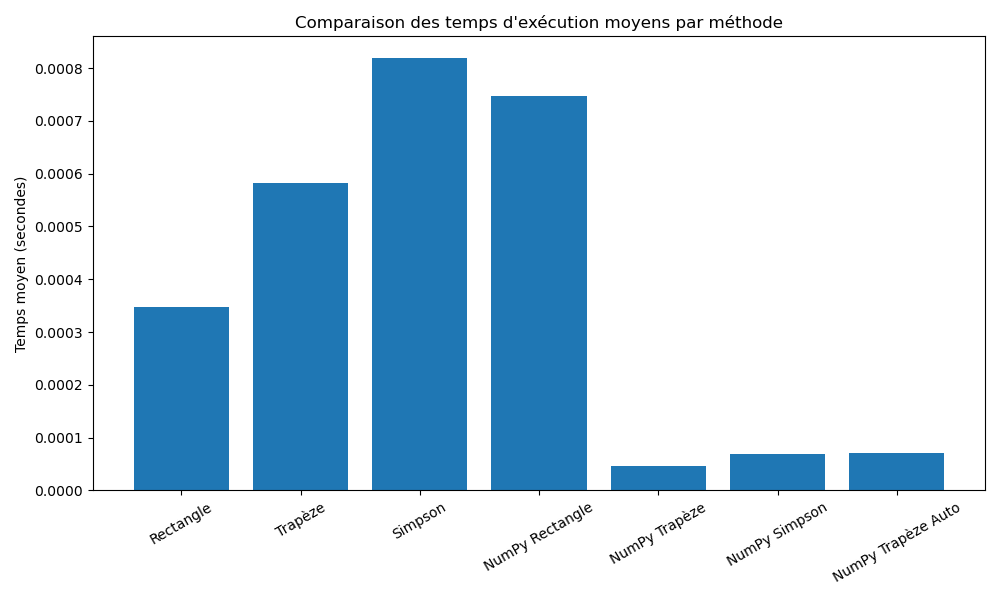
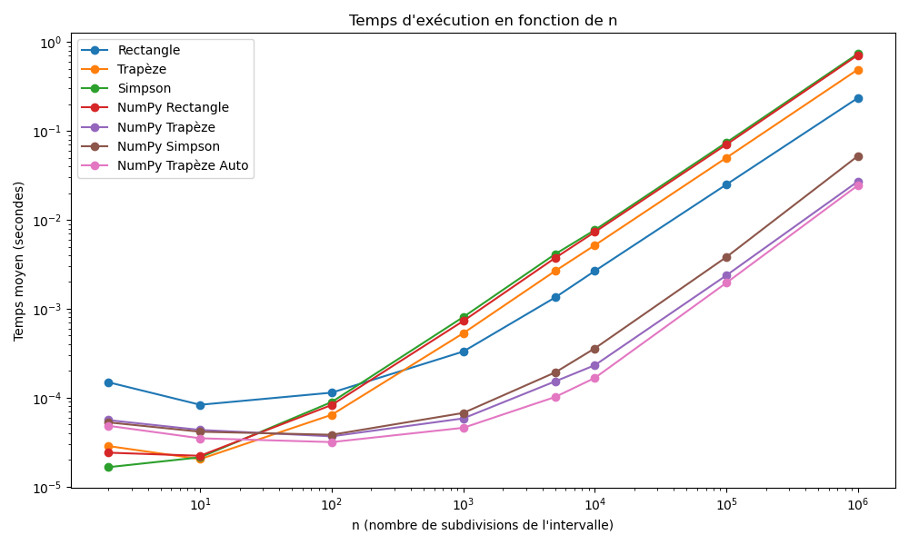

# Mini-Projet-B---Groupe-7-MGA802
# WARNING  ne fonctionne qu'en débug
Le code comporte beaucoup d'itération il peut être long a éxecuter.

# Ne pas utiliser les fichiers pour les autres calculs
Des modifications ont été apporté pour simplifier l'analyse de la performance. Ces modifications ont dégradé la qualité du code et peuvent le rendre non fonctionnel en dehors du script time_analysis.

# Figures obtenues 

